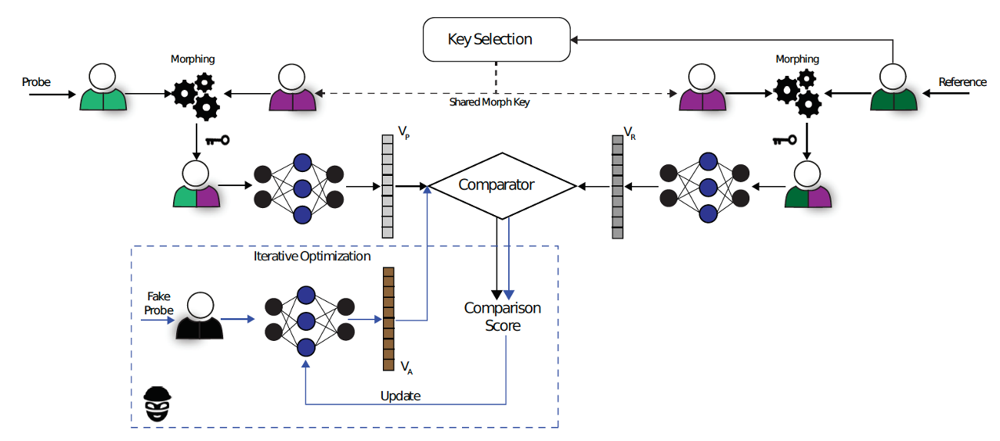
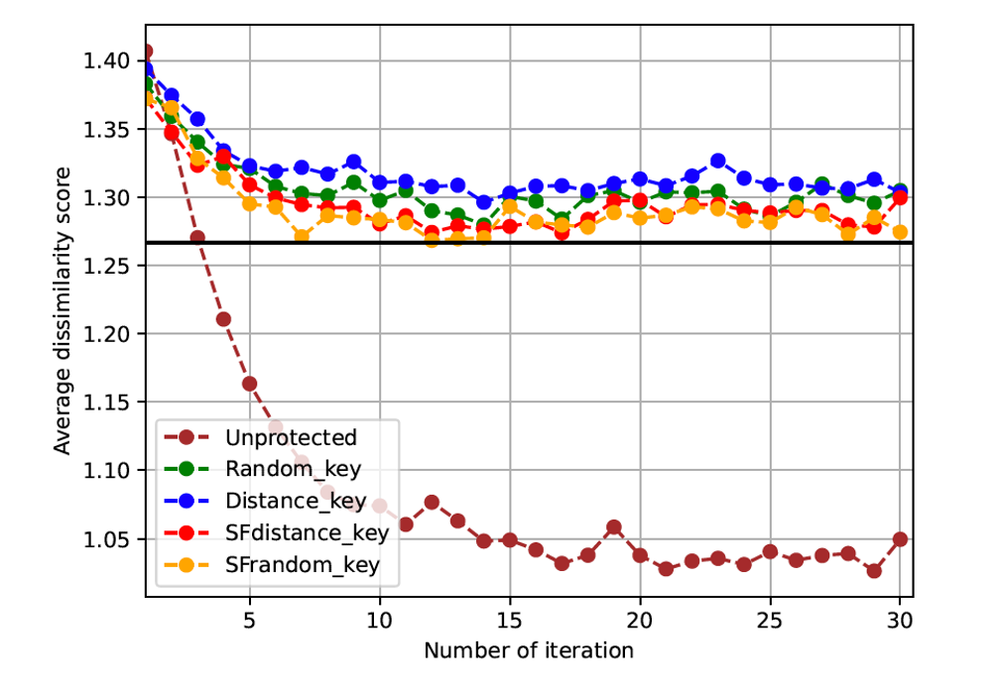
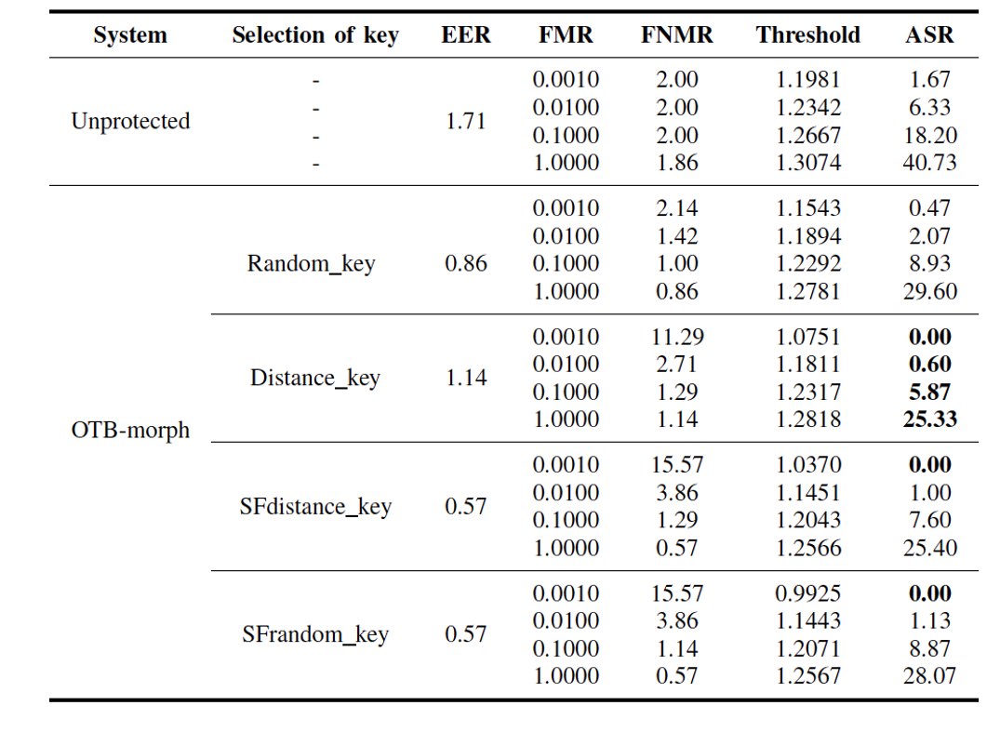
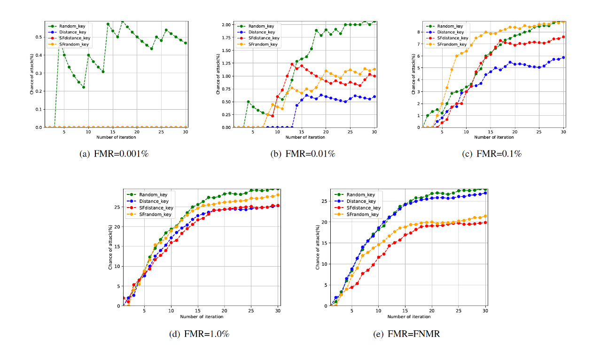

# Optimizing-Key-Selection-against-Adversarial-Attacks

Refactored code used in the paper "Optimizing Key-Selection for Face-Based One-Time Biometrics via Morphing" (WIFS 2023, Osorio-Roig et al. (https://ieeexplore.ieee.org/abstract/document/10374998)). A summary of the paper can be found at the end of this README.



### Installation


Project Organization
------------


Paper: Optimizing Key-Selection for Face-Based One-Time Biometrics via Morphing
------------

### Abstract

Nowadays, facial recognition systems are still vulnerable to adversarial attacks. These attacks vary from simple perturbations of the input image to modifying the parameters of the recognition model to impersonate an authorised subject. So-called privacy-enhancing facial recognition systems have been mostly developed to provide protection of stored biometric reference data, i.e. templates. In the literature, privacy-enhancing
facial recognition approaches have focused solely on conventional security threats at the template level, ignoring the growing concern related to adversarial attacks. Up to now, few works have provided mechanisms to protect face recognition against adversarial attacks while maintaining high security at the template level. In this paper, we propose different key selection strategies to improve the security of a competitive cancelable scheme operating at the signal level. Experimental results show that certain strategies based on signal-level key selection can lead to complete blocking of the adversarial attack based on an
iterative optimization for the most secure threshold, while for the most practical threshold, the attack success chance can be decreased to approximately 5.0%.

### Experiments

#### Evolution of the average comparison score



- Reports the average dissimilarity score achieved by the attacker (i.e. evolutionary process) across 30 different verification attempts. Horizontal black line visualizes the security threshold fixed at FMR=0.1% in the baseline (i.e. unprotected system).

- No drastic changes are observed in the trend computed by the different key selection strategies. Note that such trends remain constant and above the security threshold in most iterations.

#### Error rates (in %).



- This table shows the biometric performance, as well as the Attack Success Rates values per key selection strategy and security threshold.

- The key selection process assists in reducing the chances of attack compared to an unprotected system.

- For stricter security thresholds, the protected scheme based on Random key is vulnerable w.r.t. other key selections.


#### Cumulative attack chances across different numbers of iterations



- Cumulative attack chances across different numbers of iterations.

- It can be observed that the attack rates strongly depend on the security thresholds fixed in the system.


### Citation

If you use this code in your research, please cite the following paper:

```{bibtex}
@inproceedings{OsorioRoig-KeySelectionOTBMorph-WIFS-2023,
 Author = {D. Osorio-Roig and M. Ghafourian and C. Rathgeb and R. Vera-Rodriguez and C. Busch and J. Fierrez},
 Booktitle = {Proc. Intl. Workshop on Information Forensics and Security ({WIFS})},
 File = {:https\://cased-dms.fbi.h-da.de/literature/Osorio-Roig-OsorioRoig-KeySelectionOTBMorph-WIFS-2023.pdf:URL},
 Groups = {default},
 Keywords = {Soft Biometrics, Face Recognition, Data Privacy},
 Organization = {IEEE},
 Pages = {1--6},
 Title = {Optimizing Key-Selection for Face-based One-Time Biometrics via Morphing},
 Year = {2023}
}
```
